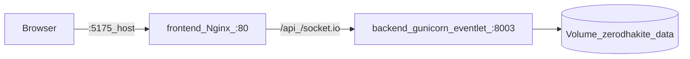

# Architecture — ZerodhaKiteGit (Docker)

1. User opens `http://host:5175` → static CRA build.
2. Same-origin `/api/*` and `/socket.io/*` → Nginx → `http://backend:8003`.
3. `TRUST_PROXY=1` on backend so `X-Forwarded-Host` / `X-Forwarded-Proto` match the browser URL (OAuth, sessions).

## Configuration layers

| Layer | Location |
|-------|----------|
| Backend env | `backend/.env` (from `env_template.txt`) |
| Compose | `docker-compose.yml` / `docker-compose.prod.yml` |
| Container Nginx | `frontend/nginx.conf` |
| Frontend build args | `REACT_APP_*` empty for same-origin behind Nginx |

## Related

- [deploy.md](deploy.md) — commands and port matrix
